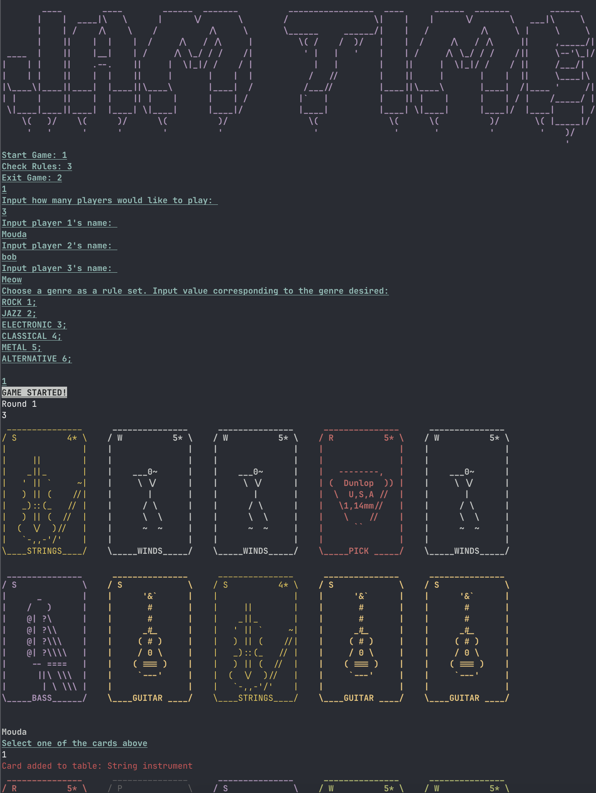
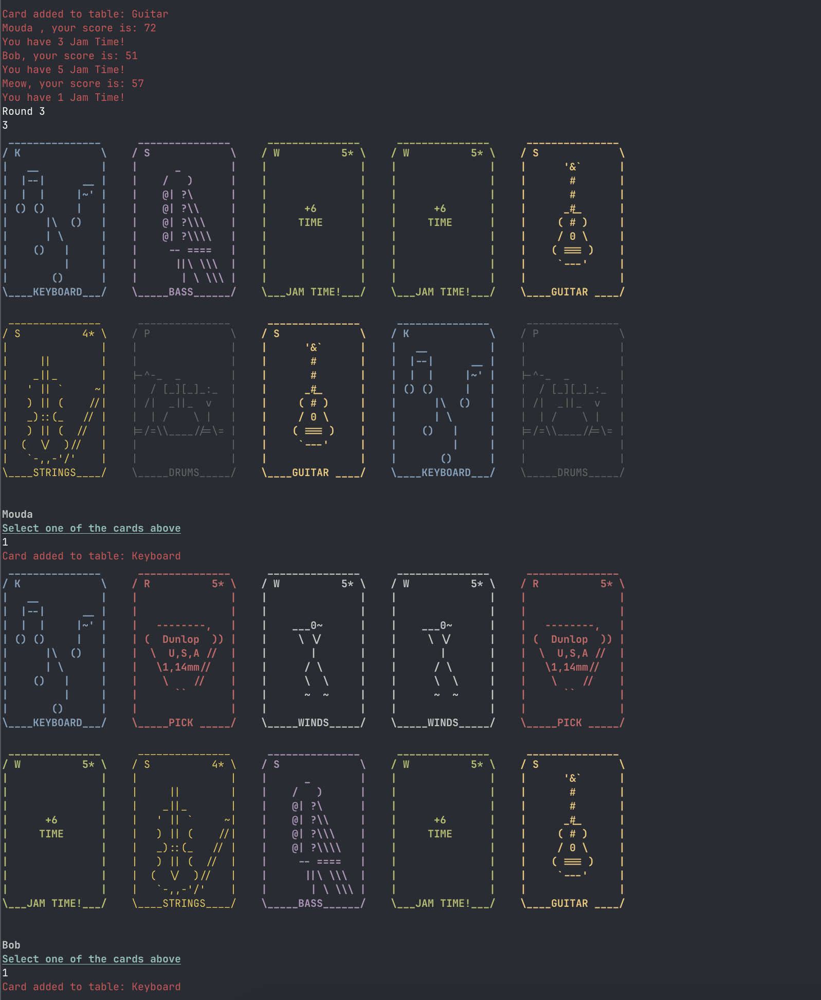
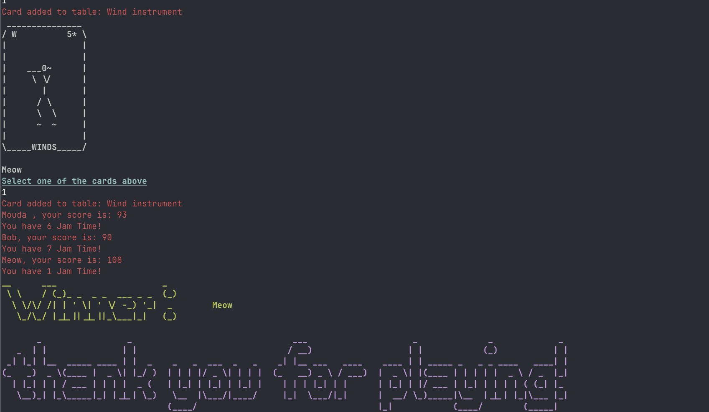

# Jam Time - Sushigo-like Card Game
A *musical* take on Sushigo! Jam Time consists of a deck of 32 cards split over 3 hands for the duration of 3 rounds. Each player will get a deck and will have to decide to pick only **ONE** of the cards and swap hands with the next player. Each round is played until the hands are exhausted. After a round, all cards are discarded and put back into the deck except "Jam Time" (more on that in the section below). Each card in this game help you score points differently!
* String cards represent string instruments. This means you can play them with a pick (explained one point below!). String cards include:
1.  Guitars
2.  Bass
3.  Other string instruments (left for interpretation but likely violins, cellos and violas)
* Pick cards are important to use along string instrumants (previously mentioned!). They can be paired anytime. This means that as long as you have both cards
together, you will benefit from the boost.
* Jam Time is an essential card to collect. It counts how much time you spend Jamming! You can't just collect the instruments you need: you have to **use** them efficiently! Watch out!! ***You will be punished or rewarded depending on how much jam time you collect***

## Genres - More ways to play!
There are multiple genres to choose from before starting a game. Genres will favorise some instruments over others, so make sure to note the genre you are working with, as it can make the difference between scoring more or less than your foes.

## How to run:
1. Make sure to have GitBash installed on your machine
2. Execute this follwing command: `git clone https://gitlab.com/mouda1/winter2025-sushigo.git` in GitBash
3. Change your directory to the game directory (execute this command: `cd winter2025-sushigo`)
4. Make sure you have JDK installed (this game requires the *Java* compiler) - Here's a link to download the latest version of Java Developer's Kit: [Scroll down and look for the correct version of JDK for your device](https://www.oracle.com/ca-en/java/technologies/downloads/#jdk24-linux)
5. Compile the entire application with the command: `javac *.java` - ***Still on GitBash***
6. Run the compiled Main java class with the command: `java Main` - ***GitBash still >.<***
### 7. **Enjoy! <333**

